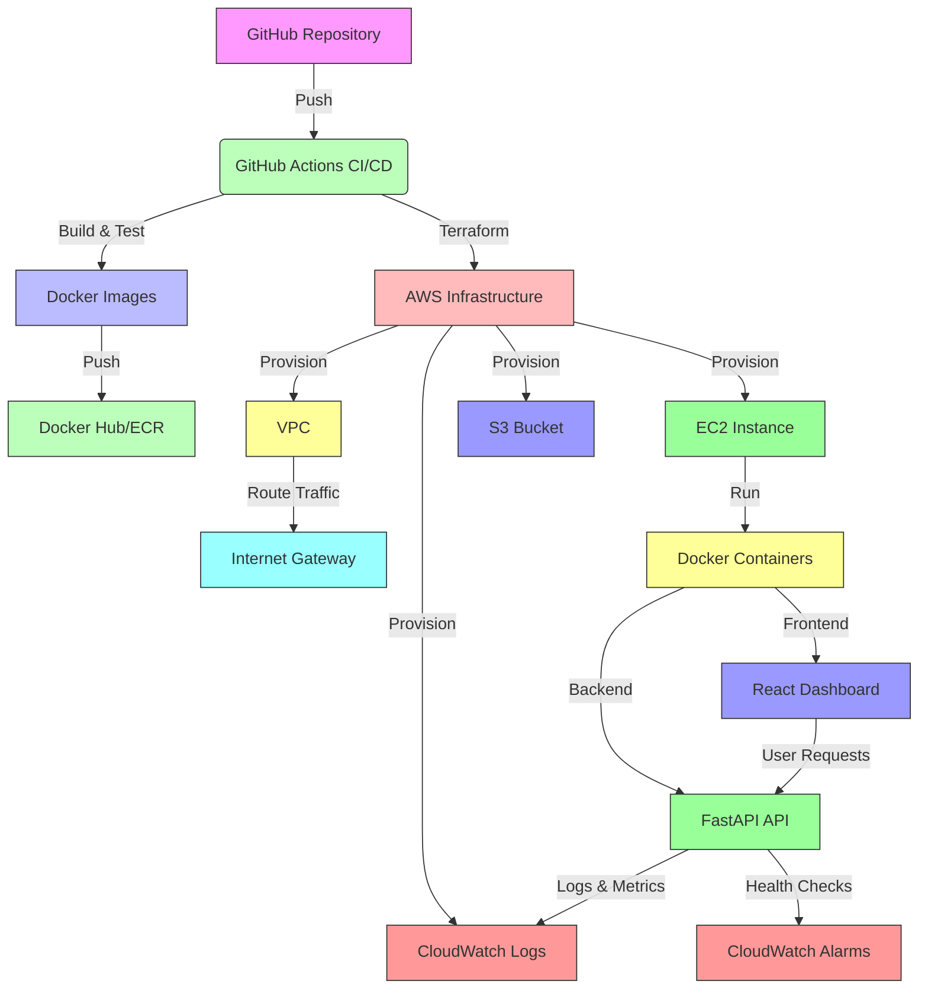

# CloudDeploy Pro – Multi-Environment Infrastructure-as-Code & CI/CD Platform

A production-grade, multi-environment AWS DevOps project demonstrating infrastructure as code, containerization, and CI/CD best practices used by industry leaders.

## Table of Contents
- [Overview](#overview)
- [Features](#features)
- [Technology Stack](#technology-stack)
- [Project Structure](#project-structure)
- [Prerequisites](#prerequisites)
- [AWS Setup](#aws-setup)
- [GitHub Secrets Setup](#github-secrets-setup)
- [Deployment Guide](#deployment-guide)
- [Architecture](#architecture)
- [Monitoring](#monitoring)
- [Security](#security)
- [Troubleshooting](#troubleshooting)
- [Contributing](#contributing)
- [License](#license)

## Overview

CloudDeploy Pro is a complete DevOps platform that enables automated deployment to AWS using Terraform for infrastructure provisioning, Docker for containerization, and GitHub Actions for CI/CD. The platform includes a modern web dashboard that displays system status, deployment information, and health metrics.

Designed for scalability and security, this project implements:
- Multi-environment deployment (dev/staging/production)
- Infrastructure as Code with Terraform modules
- Secure CI/CD pipeline with automated testing and rollback
- Comprehensive monitoring with CloudWatch
- Production-ready Docker images with multi-stage builds
- Role-based access control via IAM
- Secrets management through GitHub Secrets
- Health checks and application metrics

## Features

��✅ **Infrastructure as Code**
- Terraform modules for VPC, EC2, IAM, Security Groups, S3, and CloudWatch
- Environment-specific configurations (dev/staging/production)
- Automated resource provisioning and destruction

��✅ **CI/CD Pipeline**
- GitHub Actions workflows for build, test, security scan, and deployment
- Automated Docker image building and pushing to Amazon ECR (simulated via Docker Hub for simplicity)
- Terraform plan/apply with validation
- Automated rollback on failure
- Pre-deployment checks (formatting, linting, unit tests, security scanning)

��✅ **Application Stack**
- Backend: Python FastAPI with RESTful endpoints
- Frontend: React + Vite + TypeScript dashboard
- Containerization: Multi-stage Docker builds with health checks
- Monitoring: CloudWatch metrics and logs integration

��✅ **Security Best Practices**
- Principle of least privilege IAM roles
- No hardcoded credentials
- Environment variable-based configuration
- Security group restrictions
- Input validation and sanitization
- Non-root container execution
- Dependency vulnerability scanning

��✅ **Observability**
- Real-time system metrics (CPU, memory, disk)
- Deployment version and Git commit tracking
- Health check endpoints
- Application logging to CloudWatch
- Environment selector for multi-environment visibility

## Technology Stack

### Infrastructure
- **Terraform** - Infrastructure provisioning
- **AWS** - Cloud provider (VPC, EC2, IAM, S3, CloudWatch)
- **Docker** - Containerization
- **Docker Compose** - Local development orchestration

### CI/CD
- **GitHub Actions** - Automation platform
- **Python** - Backend language (FastAPI)
- **Node.js** - Frontend tooling (React, Vite, TypeScript)

### Application
- **Backend**: Python 3.9+, FastAPI, Uvicorn
- **Frontend**: React 18, Vite, TypeScript, Custom CSS Design System
- **Container**: Multi-stage Docker builds (Python & NodeJS)
- **Monitoring**: Amazon CloudWatch

### Development Tools
- **Git** - Version control
- **Prettier** - Code formatting
- **ESLint** - JavaScript/TypeScript linting
- **Flake8** - Python linting
- **Bandit** - Python security scanning
- **Hadolint** - Dockerfile linting
- **Trivy** - Container vulnerability scanning

## Project Structure

```
clouddeploy-pro/
├── backend/                 # FastAPI application
│   ├── app/                 # Application code
│   ├── tests/               # Unit tests
│   ├── requirements.txt     # Python dependencies
│   ├── Dockerfile           # Backend Dockerfile
│   └── ... 
├── frontend/                # React dashboard
│   ├── src/                 # Source code
│   ├── package.json         # Node dependencies
│   ├── Dockerfile           # Frontend Dockerfile
│   └── ...
├── terraform/               # Infrastructure as Code
│   ├── modules/             # Reusable Terraform modules
│   ├── dev/                 # Development environment
│   ├── staging/             # Staging environment
│   └── production/          # Production environment
├── .github/workflows/       # GitHub Actions CI/CD
├── docker/                  # Docker-compose configurations
├── scripts/                 # Utility scripts
├── docs/                    # Documentation
├── architecture/            # Architecture diagrams
├── monitoring/              # Monitoring configurations
├── README.md
�└── LICENSE
```

## Prerequisites

Before deploying CloudDeploy Pro, ensure you have:

1. **AWS Account** with appropriate permissions
2. **Terraform** >= 1.0.0 installed
3. **Docker** >= 20.10 installed
4. **Git** >= 2.30 installed
5. **Python** >= 3.9 installed (for backend development)
6. **Node.js** >= 18.0 installed (for frontend development)
7. **GitHub Account** for hosting the repository and Actions
8. **AWS CLI** configured with your credentials

## AWS Setup

1. **Create an IAM User** with programmatic access and attach the following policies:
   - `AdministratorAccess` (for simplicity in this project; in production, use least privilege)
   - Or create custom policy with permissions for:
     - EC2: `RunInstances`, `TerminateInstances`, `Describe*`
     - IAM: `CreateRole`, `AttachRolePolicy`, `PassRole`
     - S3: `CreateBucket`, `PutObject`, `GetObject`, `ListBucket`
     - CloudWatch: `PutMetricData`, `CreateLogGroup`, `PutLogEvents`
     - VPC: `CreateVPC`, `CreateSubnet`, `CreateInternetGateway`, etc.
     - ECR: `GetAuthorizationToken`, `BatchCheckLayerAvailability`, `PutImage`, `InitiateLayerUpload`, `UploadLayerPart`, `CompleteLayerUpload`

2. **Configure AWS CLI**:
   ```bash
   aws configure
   ```

3. **Create an S3 Bucket** for Terraform state (optional but recommended for production):
   ```bash
   aws s3api create-bucket --bucket your-terraform-state-bucket --region us-east-1
   ```

## GitHub Secrets Setup

Configure the following secrets in your GitHub repository (`Settings > Secrets and variables > Actions`):

| Secret Name | Description | Example Value |
|-------------|-------------|---------------|
| `AWS_ACCESS_KEY_ID` | AWS access key ID | `AKIA...` |
| `AWS_SECRET_ACCESS_KEY` | AWS secret access key | `your_secret_key` |
| `AWS_DEFAULT_REGION` | AWS region (e.g., us-east-1) | `us-east-1` |
| `DOCKER_USERNAME` | Docker Hub username (for image pushing) | `your_dockerhub_user` |
| `DOCKER_PASSWORD` | Docker Hub password or access token | `your_token` |
| `TF_STATE_BUCKET` | S3 bucket name for Terraform state (if used) | `my-terraform-state` |
| `TF_STATE_KEY` | Terraform state file key (if used) | `clouddeploy-pro/terraform.tfstate` |
| `SSH_PRIVATE_KEY` | Private key for SSH access to EC2 instances | contents of your .pem file |
| `SSH_PUBLIC_KEY` | Public key for SSH access (added to EC2) | contents of your .pub file |

## Deployment Guide

### Local Development

1. **Clone the repository**:
   ```bash
   git clone https://github.com/your-username/clouddeploy-pro.git
   cd clouddeploy-pro
   ```

2. **Backend Development**:
   ```bash
   cd backend
   python -m venv venv
   source venv/bin/activate  # Linux/Mac
   venv\Scripts\activate     # Windows
   pip install -r requirements.txt
   uvicorn app.main:app --reload
   ```

3. **Frontend Development**:
   ```bash
   cd frontend
   npm install
   npm run dev
   ```

4. **Using Docker Compose (for local testing)**:
   ```bash
   cd docker
   docker-compose up --build
   ```
   Access the dashboard at http://localhost:3000

### Production Deployment via GitHub Actions

1. **Push code to GitHub** - This triggers the CI/CD pipeline
2. **Monitor the GitHub Actions workflow** under the Actions tab
3. **Verify deployment** by checking the EC2 instance's public IP
4. **Access the dashboard** at http://<ec2-public-ip>:3000

### Manual Terraform Deployment (Optional)

1. **Initialize Terraform**:
   ```bash
   cd terraform/production  # or dev/staging
   terraform init
   ```

2. **Review the plan**:
   ```bash
   terraform plan -var-file="production.tfvars"
   ```

3. **Apply the infrastructure**:
   ```bash
   terraform apply -var-file="production.tfvars"
   ```

4. **Deploy the application** (after Terraform creates EC2):
   ```bash
   # SSH into the EC2 instance (using the IP from Terraform output)
   ssh -i your-key.pem ubuntu@<ec2-public-ip>
   
   # On the EC2 instance:
   docker pull your-dockerhub-user/clouddeploy-pro-backend:latest
   docker pull your-dockerhub-user/clouddeploy-pro-frontend:latest
   docker-compose -f /opt/clouddeploy-pro/docker-compose.yml up -d
   ```

## Architecture

### High-Level Architecture


### Detailed Component Architecture
See [ARCHITECTURE.md](./docs/ARCHITECTURE.md) for detailed component diagrams.

## Monitoring

CloudDeploy Pro implements comprehensive monitoring through Amazon CloudWatch:

### Metrics Collected
- **System Metrics**: CPU utilization, memory usage, disk space, network I/O
- **Application Metrics**: Request latency, error rates, throughput
- **Deployment Metrics**: Deployment frequency, lead time, rollback frequency
- **Container Metrics**: Container restarts, memory limits, CPU throttling

### Logging
- Application logs forwarded to CloudWatch Logs
- Docker container logs captured
- System logs (syslog, auth) monitored
- Deployment and rollback events logged

### Dashboards
- Pre-built CloudWatch dashboard showing key metrics
- Custom application dashboard in the frontend
- Deployment history and version tracking

### Alerts
- Configurable alarms for system thresholds
- Deployment failure notifications
- Security event alerts
- Health check failure alerts

## Security

### Identity & Access Management
- Least privilege IAM roles for EC2 instances
- Separate IAM roles per environment
- No root access to containers
- SSH key-based access to EC2 instances

### Data Protection
- Environment-specific configuration via Terraform variables
- Secrets managed through GitHub Secrets (never in code)
- S3 bucket encryption (if enabled)
- Data in transit protected via HTTPS (ready for ALB integration)

### Network Security
- VPC with public and private subnets
- Security groups restricting access to necessary ports
- Internet gateway for public subnets only
- No direct internet access to private resources

### Application Security
- Input validation and sanitization in FastAPI endpoints
- Dependency scanning with Bandit and Safety
- Container vulnerability scanning with Trivy
- Non-root user execution in Docker containers
- Regular base image updates

### Compliance
- Audit logging for administrative actions
- Configuration drift detection
- Immutable infrastructure principles
- Version-controlled infrastructure and application code

## Troubleshooting

### Common Issues

1. **Terraform Apply Fails**
   - Check AWS credentials and permissions
   - Verify state bucket exists and is accessible
   - Run `terraform fmt` and `terraform validate`
   - Check provider versions in `versions.tf`

2. **Deployment Fails in GitHub Actions**
   - Check workflow logs for specific error messages
   - Verify Docker Hub credentials in GitHub Secrets
   - Ensure EC2 security group allows SSH from GitHub Actions IPs
   - Validate Terraform variables in environment tfvars files

3. **Application Not Accessible**
   - Check EC2 instance status and public IP
   - Verify security group allows inbound traffic on port 3000
   - Check Docker container logs: `docker logs <container_name>`
   - Validate health check endpoint: `curl http://localhost:8000/health`

4. **High Resource Usage**
   - Check CloudWatch metrics for spikes
   - Review application logs for errors or infinite loops
   - Consider scaling EC2 instance type
   - Check for memory leaks in application code

### Debugging Commands

```bash
# Check EC2 instance status
aws ec2 describe-instances --filters "Name=tag:Name,Values=clouddeploy-pro-*"

# View CloudWatch logs
aws logs get-log-events --log-group-name /ecs/clouddeploy-pro --limit 50

# SSH into EC2 for manual debugging
ssh -i your-key.pem ubuntu@<ec2-public-ip>

# Check Docker containers
docker ps
docker logs clouddeploy-pro-backend
docker logs clouddeploy-pro-frontend

# View application logs inside container
docker exec -it clouddeploy-pro-backend tail -f /var/log/app.log
```

## Contributing

We welcome contributions to CloudDeploy Pro! Please follow these guidelines:

1. Fork the repository
2. Create a feature branch (`git checkout -b feature/amazing-feature`)
3. Commit your changes (`git commit -m 'Add: amazing feature'`)
4. Push to the branch (`git push origin feature/amazing-feature`)
5. Open a Pull Request

Please ensure your code follows:
- PEP 8 for Python code
- ESLint and Prettier for JavaScript/TypeScript
- Terraform formatting standards
- Comprehensive commit messages
- Updated documentation where applicable

## License

This project is licensed under the MIT License - see the [LICENSE](LICENSE) file for details.

## Acknowledgments

- Inspired by AWS Well-Architected Framework
- Based on DevOps practices from Amazon, Netflix, and Google
- Terraform module structure inspired by Gruntwork
- GitHub Actions workflows modeled after industry CI/CD patterns
- Dashboard design influenced by modern observability platforms

---

**CloudDeploy Pro** - Built for engineers who demand production-grade DevOps solutions.